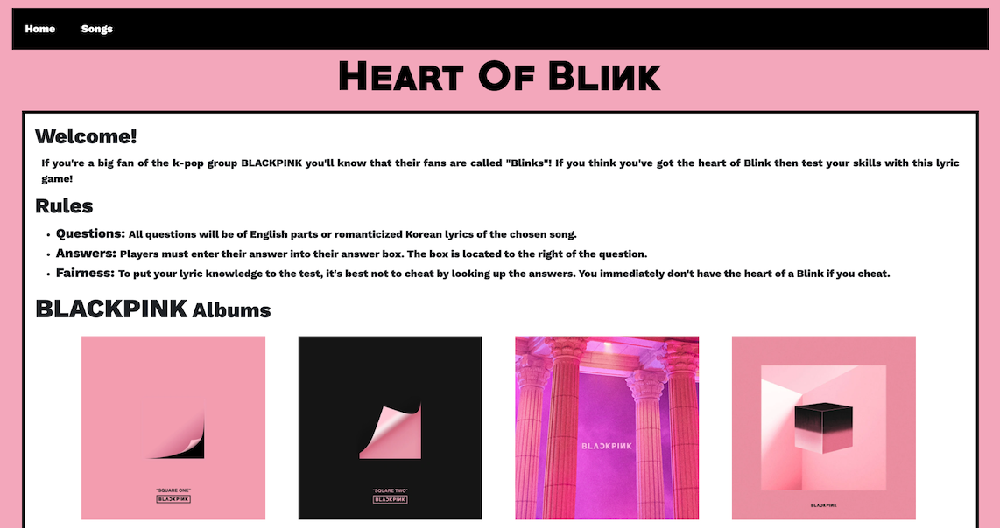
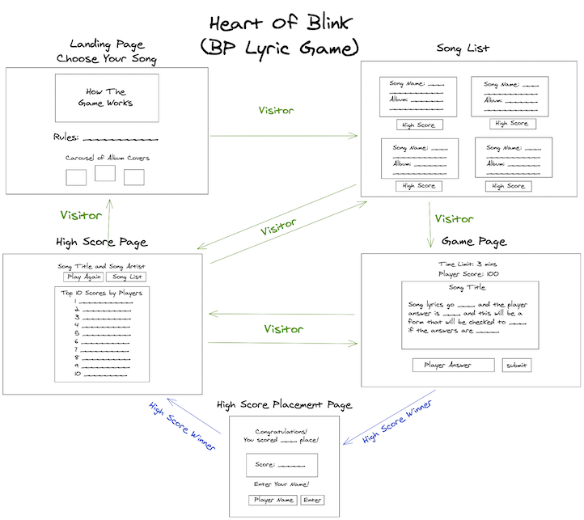
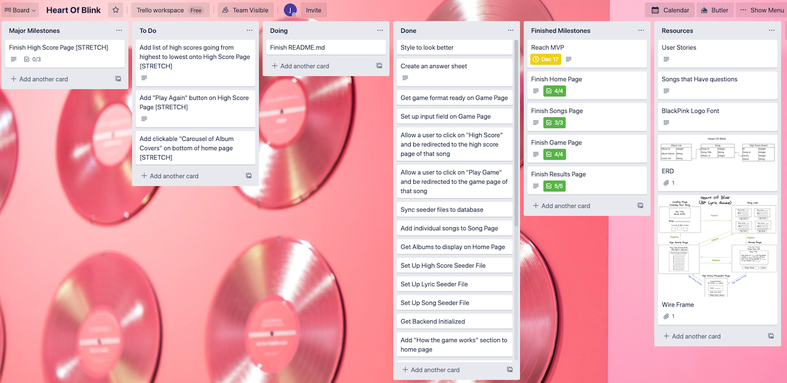
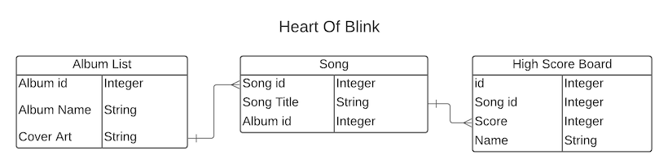
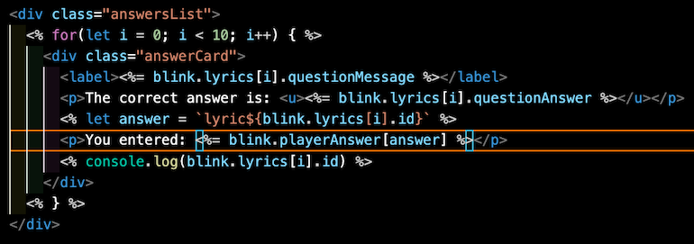
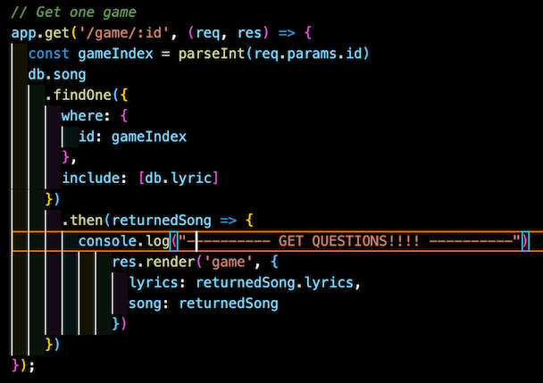

# Heart Of Blink
If you're a big fan of the k-pop group Black Pink you'll know that their fans are called "Blinks" and if you think you've got the true heart of a Blink then you'll master this lyric game!

## User Stories
- As a user, I want to be able to see the full list of songs.
- As a user, I want to be able to see the albums names and what songs belong to them.
- As a user, I want to be able to click on a song and be taken to a game page.
- As a user, I want to be able to play the game by entering my answers into a blank.
- As a user, I want to be able to submit my answers by clicking on the "submit" button.
- As a user, I want to be able to see all of the correct answers to the questions.
- As a user, I want to be able to see all of the answers I entered into the blank.
- As a user, I want to be able to be taken to the full song list by pressing the "choose another song" button at the bottom of the answers page.

## Technologies Used
- Postgres
- Express
- Node.js
- Bootstrap

## Wireframing/Pre-coding Planning

## ERD

## Code Snippets
This code shows the "results.ejs" file and how the lyric question is displayed for reference, the correct answer is shown in green to the player, and it is also able to show the player what answer they entered into the input field.

This code shows the backend of the application, specifically the route that gets one game based on the index of the song the player has chosen.

## Motivation
For the final project of my bootcamp cohort, I knew I wanted to build a game. Though it wasn't my original plan, I knew that deep down, it was what I wanted to do. My love for k-pop was also a big factor in my decision making process. I have been a fan of Korean pop music (K-pop) for over 7 years now and with its publicity increasing in 2020, I found this as the perfect time to build a game that includes one of the biggest K-Pop groups known in America. Even though BLACKPINK is not my absolute favorite K-pop group, I knew that if I wanted to do a game about lyrics, it had to be a group that had many English lines in their songs. With 3/4 members of BLACKPINK fluent in English and have lived abroad before becoming musicians, they were a no brainer with which group to choose for this project.

## Personal Takeaways
If this solo, final project has taught me anything, it's that learning both front-end and back-end is super important for a career in the tech industry. I, personally, identify as a front-end developer so when this project was announced as a full stack, solo project, I dreaded it. I knew that I wasn't confident at back-end work, but I knew I had to try. I knew that in the end of it all, after this cohort, and when the job search in the tech industry truly begins, being able to work with both front-end and back-end is like having a super power. I made sure to reach out to instructors and TA's for any help if I were absolutely stuck on a problem. I also asked my classmates to see if they could share any knowledge with me. Completing this project made me more confident with the back-end and connecting it forward to my specialty.

I also knew that if I wanted to be more confident and understanding of my code, that it had to be built from the ground up. Our instructors have provided us with starter code to get the class up and running, but I felt like using starter code would only hinder me from truely understanding my code. I can confidently say that my application was built from the ground up, using the starter code as a reference at times, but never actually cloned into my project. It was a struggle, but it made me learn.

## Special Thanks
Without the instructional team I wouldn't have been able to reach MVP and get my app to where it is today. This is also a final project for the cohort and I want to thank every one of them for their hard work in teaching my classmates and I everything we've learned.
- Brock Whitbread-Cole
- James Sinkler
- Michael Petty
- Uyen Lam
- Jacob Kleiman

I also want to thank a few classmates that have helped and supported me through the final project and the entirety of the cohort. Without them as debugging partners, constant reminders that "We can do it!", and overall amazing people I can now call friends, I want to thank these people that I've gotten close to... in no particular order.
- Brock Molmen
- Lauren Nguyen
- Jane Cho
- Ashley Nguyen
- Lucia Franco
- Tess Bishop
- Kelsey Whallon
- Casey Jenkins

## Future Development
Due to feasability and the time constraint, I had to cut back on a few features that eventually became stretch goals. In the future I plan on revisiting this project and implementing everything I had to cut out for the first version. These features included:

- Having every single song be playable. I had to choose a few mainstream songs for now, but I do plan on making every song available to a player
- Inserting a scoring and high score feature that logs a player's score and displays them on the high score board
- Making a multiple choice feature for players to choose one option from 4 different answers.